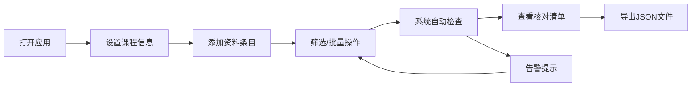

## 1. 产品概述

浏览器端资料包组合工具，帮助培训机构高效整理单次课程所需的讲义、练习册、贴页和测试卡等教学资料。纯前端实现，不依赖后端服务，数据仅在内存中维护，支持导出为 JSON 文件。

- **目标用户**：培训机构教务人员、课程顾问、教师
- **核心价值**：提升资料准备效率，减少遗漏和错误，确保课前资料齐全
- **使用场景**：单次课程资料包规划、课前核对、资料库存管理

## 2. 核心功能

### 2.1 用户角色

| 角色 | 注册方式 | 核心权限 |
|------|----------|----------|
| 教务人员 | 无需注册，直接使用 | 完整的资料管理、筛选、检查、导出功能 |

### 2.2 功能模块

1. **课程信息设置**：课程名称、日期、班级代号、预计人数
2. **资料条目管理**：资料名、版本、份数、备用份数、适用环节、准备状态、备注
3. **筛选功能**：按环节、状态、版本、份数异常筛选
4. **批量操作**：批量调整份数、批量标记状态、复制上一场课程资料
5. **数据检查**：份数不足检查、版本混用检查、环节重复检查、备注缺失检查
6. **课前核对清单**：按环节汇总展示需要准备的资料
7. **数据导出**：导出为 JSON 文件

### 2.3 页面详情

| 页面名称 | 模块名称 | 功能描述 |
|----------|----------|----------|
| 主页面 | 课程信息卡 | 设置课程名称、日期、班级代号、预计人数 |
| 主页面 | 资料列表 | 展示所有资料条目，支持增删改查 |
| 主页面 | 筛选工具栏 | 按环节、状态、版本、份数异常进行筛选 |
| 主页面 | 批量操作栏 | 批量调整份数、批量修改状态、复制上一场 |
| 主页面 | 检查告警区 | 显示份数不足、版本混用、环节重复、备注缺失等告警 |
| 课前核对清单视图 | 环节分组清单 | 按教学环节分组展示需准备的资料清单 |
| 课前核对清单视图 | 进度统计 | 展示已准备/待准备/需加印的数量统计 |

## 3. 核心流程

用户打开应用 → 设置课程基本信息 → 添加/导入资料条目 → 筛选和批量调整 → 系统自动检查异常 → 查看课前核对清单 → 导出 JSON 数据

## 4. 用户界面设计

### 4.1 设计风格

- **主色调**：深海蓝 (#1e3a5f) - 专业、稳重，适合教育场景
- **辅助色**：琥珀橙 (#f59e0b) - 用于强调、告警、操作按钮
- **成功色**：翡翠绿 (#10b981) - 已准备状态
- **警告色**：珊瑚红 (#ef4444) - 异常、需加印
- **中性色**： slate 灰色系 - 文字、背景、边框
- **按钮风格**：圆角 8px，悬停有微妙阴影和颜色加深
- **字体**：现代无衬线字体，标题使用半粗体，正文使用常规字重
- **布局风格**：卡片式布局，顶部标题栏，左侧筛选，主内容区列表
- **图标风格**：使用 lucide-react 线性图标，简约清晰

### 4.2 页面设计概述

| 页面名称 | 模块名称 | UI 元素 |
|----------|----------|---------|
| 主页面 | 顶部标题栏 | 应用名称、视图切换、导出按钮 |
| 主页面 | 课程信息卡 | 四列网格布局，输入框带标签 |
| 主页面 | 筛选工具栏 | 下拉选择器、标签式筛选、搜索框 |
| 主页面 | 资料列表 | 表格布局，支持行内编辑、状态标签 |
| 主页面 | 批量操作栏 | 复选框、操作按钮、数量统计 |
| 主页面 | 告警面板 | 可折叠卡片，分类展示异常项 |
| 核对清单页 | 环节分组 | 手风琴式折叠面板，按环节分组 |
| 核对清单页 | 进度概览 | 统计卡片、进度条 |

### 4.3 响应式

桌面端优先设计，适配平板尺寸。在小屏幕上采用单列布局，表格转换为卡片列表形式。

### 4.4 交互细节

- 状态标签使用不同颜色和背景区分
- 悬停行高亮显示
- 添加/编辑使用侧边抽屉式表单
- 告警项可点击跳转到对应资料
- 数量输入框支持步进按钮
