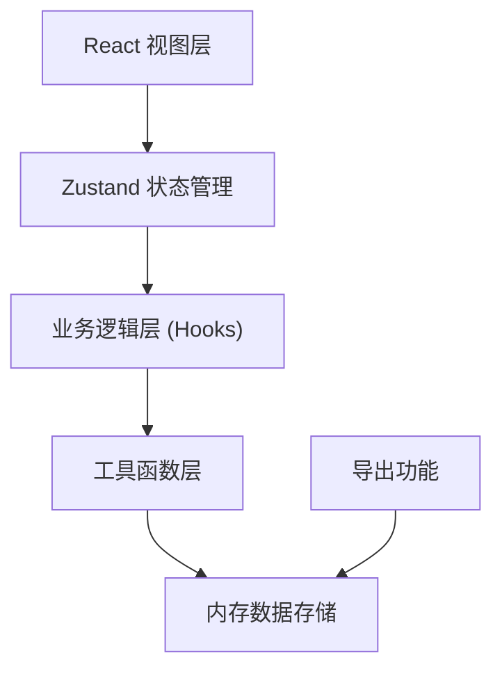

## 1. 架构设计

纯前端单页应用，所有数据在浏览器内存中维护，不依赖后端服务。使用 Zustand 进行状态管理，支持数据导出为 JSON 文件。



## 2. 技术描述

- **前端框架**：React 18 + TypeScript
- **构建工具**：Vite 5
- **样式方案**：Tailwind CSS 3
- **状态管理**：Zustand
- **图标库**：lucide-react
- **路由**：react-router-dom (单视图切换，使用状态管理代替路由)
- **后端**：无
- **数据库**：无，数据仅在内存中维护

## 3. 状态管理设计

### 3.1 Store 结构

```typescript
interface CourseInfo {
  name: string;
  date: string;
  classCode: string;
  expectedCount: number;
}

type MaterialStatus = 'pending' | 'ready' | 'reprint' | 'cancelled';

interface Material {
  id: string;
  name: string;
  version: string;
  copies: number;
  spareCopies: number;
  stage: string;
  status: MaterialStatus;
  remark: string;
}

interface MaterialStore {
  courseInfo: CourseInfo;
  materials: Material[];
  selectedIds: string[];
  filters: {
    stage: string;
    status: string;
    version: string;
    showAbnormal: boolean;
  };
  previousCourseMaterials: Material[] | null;
}
```

## 4. 组件结构

```
src/
├── components/
│   ├── CourseInfoCard.tsx      # 课程信息设置卡片
│   ├── MaterialTable.tsx       # 资料列表表格
│   ├── MaterialForm.tsx        # 资料添加/编辑表单
│   ├── FilterBar.tsx           # 筛选工具栏
│   ├── BatchActionBar.tsx      # 批量操作栏
│   ├── AlertPanel.tsx          # 告警面板
│   ├── ChecklistView.tsx       # 课前核对清单视图
│   └── StatusBadge.tsx         # 状态标签组件
├── hooks/
│   ├── useMaterialStore.ts     # Zustand store
│   ├── useMaterialChecks.ts    # 资料检查逻辑
│   └── useFilteredMaterials.ts # 筛选逻辑
├── utils/
│   ├── exportJson.ts           # JSON 导出工具
│   └── idGenerator.ts          # ID 生成器
├── types/
│   └── index.ts                # 类型定义
├── App.tsx                     # 主应用组件
└── main.tsx                    # 入口文件
```

## 5. 数据检查逻辑

### 5.1 检查项定义

1. **份数低于预计人数**：`copies + spareCopies < expectedCount`
2. **版本混用**：同一资料名称存在多个不同版本
3. **同一环节资料重复**：同一环节下存在相同名称的资料
4. **备注缺失**：状态为"待准备"或"需加印"但备注为空

### 5.2 检查结果结构

```typescript
interface CheckResult {
  type: 'copies' | 'version' | 'duplicate' | 'remark';
  severity: 'warning' | 'error';
  message: string;
  materialIds: string[];
}
```

## 6. 核心功能实现要点

### 6.1 批量操作
- 批量修改状态：选中多条记录，统一设置状态
- 批量调整份数：支持增加/减少固定数量，或按比例调整
- 批量删除：选中多条记录删除

### 6.2 复制上一场课程
- 保存上一次课程的资料列表到状态中
- 点击"复制上一场"将历史资料追加到当前列表
- 复制后状态重置为"待准备"

### 6.3 课前核对清单
- 按教学环节分组展示资料
- 只显示非"取消使用"状态的资料
- 展示每个环节的资料数量和总份数
- 显示准备进度统计

### 6.4 JSON 导出
- 导出课程信息 + 资料列表的完整数据
- 文件名包含课程名称和日期
- 使用 Blob + URL.createObjectURL 实现下载
